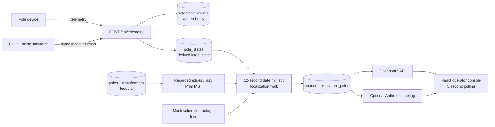

# Architecture

## Data flow

## Data sourcing and ingestion

Pole devices send one event to `POST /api/telemetry`, or batches to
`POST /api/telemetry/batch`. Both routes use the same `ingestTelemetry`
function used by the simulator. Payload fields and event names follow
`docs/DATA_CONTRACTS.md` exactly.

Ingest rejects an unknown `pole_id`. For a known pole it compares the incoming
sequence number to `PoleState.last_seq` for the current `last_device_id`:
duplicates and older sequences are rejected, `boot` resets the sequence stream,
and a device swap begins a new stream. Accepted events are appended to
`telemetry_events`; only `pole_states` is mutable derived state. Device `ts` is
not used as the ordering key because it has permitted clock skew.

## Storage and internal model

PostgreSQL holds the asset registry (`substations`, `feeders`,
`transformers`, `poles`), append-only telemetry, one live state row per pole,
and incident/ticket tables. `topology_edges` separates `recorded` surveyed
edges from `inferred` edges and stores per-edge confidence. `scheduled_outages`
backs the mock `GET /scheduled-outages` feed. Prisma owns schema access and
migrations.

The seed is deterministic and creates 2 substations, 10 feeders, 81 DTs, and
about 2,500 poles; approximately 9% have no device and approximately 60% of
DTs omit recorded topology. Container startup seeds only an empty database so
a persistent deployment does not erase telemetry on every restart.

## Deterministic localization algorithm

Localization runs every 12 seconds and can be invoked with
`POST /api/localization/run`. It is deliberately ordinary code, never an LLM.

For surveyed DTs, recorded parent/child rows form the radial tree. For the
roughly 60% with no `seq_on_line`, the first query lazily builds and caches a
Prim MST from transformer/pole coordinates using haversine distance. The
chosen-parent distance is compared with the second-nearest candidate to create
a bounded 0.3–0.95 inferred-edge confidence. This is a geometric inference,
not a claim of surveyed topology; obstacles and dense layouts can lower its
real-world reliability.

On each run, effective status is read rather than stored: unseen is `unknown`,
explicit de-energization is `dark`, and a live last state older than 17 minutes
is `stale`. A BFS begins at the DT root. Every live-to-dark/stale transition
becomes one boundary candidate and collects its contiguous dark/stale subtree.
An isolated dark pole with live children is classified as device health instead
of a power incident. Separate branches remain separate incidents. Root-dark
patterns create DT incidents; matching patterns across every DT on a feeder
create feeder incidents.

Confidence is the minimum topology confidence on the root-to-boundary path,
multiplied by sensor coverage and by corroboration (1.0 with `power_lost`, 0.6
when inferred from silence). A `power_restored` event verifies an active ticket
only after every affected pole is energized.

## Noise and false-positive handling

The simulator models at-least-once delivery, old timestamps, device reboot
sequence reset, device swaps, missing devices, and firmware 1.2 devices that
go silent without a final `power_lost`. Its duplicate, out-of-order, and late
noise requests call the production ingest function and return the accept/reject
responses; they do not construct database end states directly.

Before persisting an incident, localization queries the shared scheduled-outage
service for a matching DT or feeder. It makes an expected/suppressed record
from `start - 10 minutes` through `end + 40 minutes`, so planned maintenance
remains visible without creating an active dispatch ticket. If darkness remains
after that tolerance, any matching suppressed record is promoted to `active`.

## API surface

| Method | Path | Purpose |
|---|---|---|
| POST | `/api/telemetry` | Ingest one validated telemetry event. |
| POST | `/api/telemetry/batch` | Ingest a batch with per-event results. |
| POST | `/api/localization/run` | Trigger deterministic localization. |
| GET | `/api/network` | Map assets, effective status, topology, active/suppressed incidents. |
| GET | `/api/incidents`, `/api/incidents/:id` | Ticket list and detail. |
| POST | `/api/incidents/:id/resolve` | Resolve only if all affected poles are live. |
| POST | `/api/incidents/:id/briefing` | Fetch/generate a cached AI or fallback briefing. |
| GET | `/scheduled-outages` | Mock planned-outage feed; accepts `from` and `to` ISO query values. |
| POST | `/api/simulator/fault`, `/repair`, `/noise` | Fault lifecycle and telemetry-noise simulation. |
| POST | `/api/simulator/scheduled-outage` | Create planned outage plus matching dark telemetry. |
| GET | `/api/simulator/status` | Active simulations. |

## UI reasoning

The dashboard makes spatial condition and ticket priority visible together:
the Leaflet/OSM map colors poles by effective status, draws recorded/inferred
topology differently, and highlights incident boundaries/subtrees. The ticket
panel puts scope, confidence, affected count, PIN, evidence, and guarded manual
resolution beside the map. A separate Simulator tab protects routine operators
from test controls while keeping end-to-end verification available. Polling
every five seconds is intentional: it is simple and robust through free-tier
proxies, while staying comfortably within the localization latency target.

## AI feature boundary

`POST /api/incidents/:id/briefing` reads an already-localized ticket and sends
only fixed ticket facts to Anthropic when `ANTHROPIC_API_KEY` is configured. The
prompt explicitly forbids changing boundaries, scope, root cause, or affected
assets. Provider timeouts/errors/no key return a deterministic template and
store its source as `fallback`; the UI never needs an LLM error state. The AI
does not participate in ingestion, topology inference, localization, or status
transitions.
